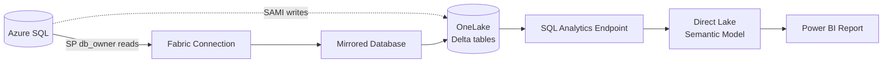

# Phase 6 — Document & Diagram the Deployment

**Goal:** A deployment is not "done" until it can describe itself. This phase generates a
**deployment record** and an **architecture diagram** from the **state file** (actual deployed
values, never guesses), plus a data-lineage table and a runbook.

> **Delegate depth:** use the `fabric-document` skill for the prose/record and the `excalidraw`
> skill for an editable diagram. Fall back to an inline Mermaid block when a quick embedded diagram
> is enough.

## Questions

1. **Diagram format?** — Mermaid (embedded, quick) or Excalidraw (editable artifact) or both.
2. **Where to write the docs?** — default `_runs/<runName>/docs/`.
3. **Include a teardown runbook?** — yes/no (recommended yes).

## Inputs

Everything is read from `mirroring-config.json` (see [state-file-schema.md](state-file-schema.md)) and,
for row counts, a live `getTablesMirroringStatus` call. No values are invented.

## Outputs

### 1. Deployment record — `docs/deployment-record.md`

Templated, generated from state. Sections:

- **Environment / identifiers** — subscription, RG, region, server, DB, workspace, capacity, mirrored item, SQL endpoint, semantic model (names + IDs; **no secrets**).
- **Policy decisions** — which tenant policies were detected and how the wizard adapted (e.g. "SQL local auth denied → Entra-only auth"). Sourced from `policy` in the state file.
- **Identities** — SP appId, SAMI principalId, where the secret is stored (`secretLocation`).
- **What was created vs. reused** — per phase.
- **Manual follow-ups** — e.g. "secret stored in Key Vault `<vault>`", "private endpoint pending".

### 2. Architecture diagram — `docs/architecture.md` (Mermaid) and/or `docs/architecture.excalidraw`

The flow the wizard always emits:



Substitute the bracketed names from the state file. Omit the `SM`/`RPT` nodes if Phase 5 was skipped.

### 3. Data lineage / table map — `docs/lineage.md`

Per mirrored table: source `schema.table` → mirrored Delta table → live row count (from
`getTablesMirroringStatus`) → whether it is part of the semantic model. Confirms replication coverage.

### 4. Runbook — `docs/runbook.md`

- **Check status:** `getMirroringStatus` (expect `Running`); `getTablesMirroringStatus` for rows.
- **Resume after idle:** resume the capacity (`az fabric capacity resume`); the serverless source DB resumes on first connect.
- **Teardown order:** stop mirroring → delete mirrored DB / semantic model → delete workspace → (optional) delete capacity → delete SQL DB/server → delete RG. Note billing implications.

## Generation rule

```powershell
$cfg = Get-Content "_runs/<runName>/mirroring-config.json" -Raw -Encoding utf8 | ConvertFrom-Json
# Render each doc from $cfg fields; write with -Encoding utf8.
# Then update $cfg.documentation.{deploymentRecordPath,diagramPath,generatedUtc} and save.
```

## Idempotency check

- Docs exist under the chosen output folder and `documentation.generatedUtc` is set in the state file.
- Re-running regenerates from current state (safe — docs are derived, not hand-edited).

## Gate

None — generating documentation is non-destructive. Confirm the output folder before overwriting existing docs.

## State written

`documentation.deploymentRecordPath`, `documentation.diagramPath`, `documentation.generatedUtc`.

## Done criteria

The run is complete only when: mirroring `status = Running`, (optional) semantic model `validated = true`,
and `documentation.generatedUtc` is set. Report the doc paths to the user as the final message.
